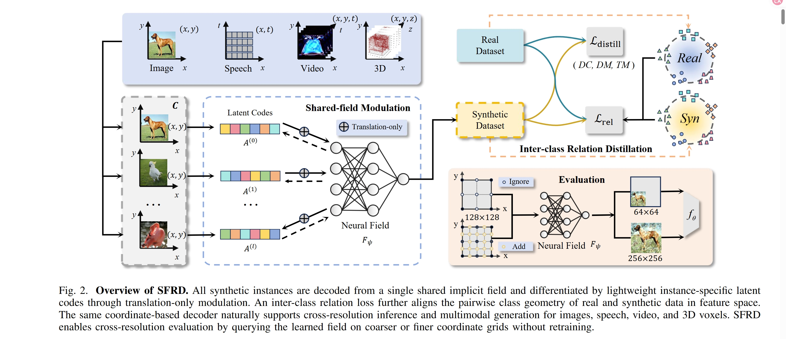
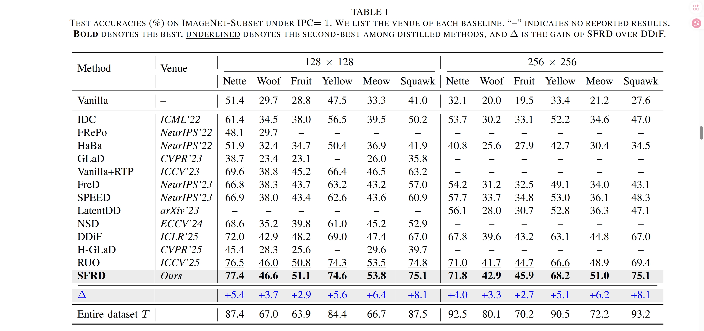
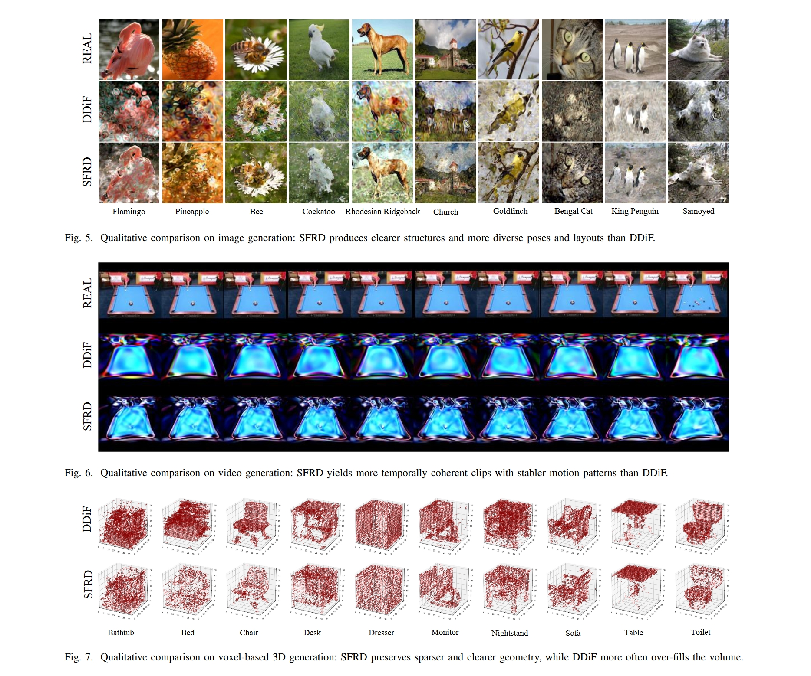

<div align="center">

# SFRD: Shared Field with Relation Distillation

#### [Project Page]() | [Paper]()

</div>

### 🧠Abstract

Dataset distillation (DD) aims to compress large datasets into compact synthetic sets. Recent neural-field DD methods parameterize each synthetic instance with an independent neural field, enabling continuous coordinate-based decoding and strong resolution flexibility. However, this design suffers from **per-instance field fragmentation**, which duplicates common structure across isolated fields and undermines efficient sharing under low budgets. To address this issue, we propose **SFRD** (**S**hared **F**ield with **R**elation **D**istillation), a neural-field dataset distillation framework built around a shared generator. SFRD factorizes synthetic data generation into **one shared implicit field** and **lightweight translation-only per-instance latent modulation**, so diversity is controlled by compact codes rather than duplicated full fields. We further introduce an **inter-class relation distillation** loss that aligns class-level feature geometry between real and synthetic data, making cross-class structure an explicit optimization target. Across low- and high-resolution DD benchmarks, as well as video, speech, and 3D domains, SFRD consistently outperforms per-instance neural-field baselines while reducing memory and training-time overhead, yielding a better quality-quantity-efficiency trade-off in low-budget distillation.

### ✨Introduction

We summarize our contributions as follows:

- We propose **SFRD**, a shared neural-field dataset distillation framework that replaces per-instance independent generators with **one shared implicit field** and **lightweight per-instance latent modulation**, thereby alleviating the fragmentation issue in prior neural-field DD methods.
- We introduce a **translation-only modulation design**, which preserves expressive instance-specific variation while remaining more parameter-efficient and optimization-friendly than scaling-based or affine alternatives under fixed storage budgets.
- We further propose an **inter-class relation distillation objective** that explicitly aligns class-level feature geometry between real and synthetic data, turning cross-class structure into a direct optimization target rather than relying only on implicit coupling through shared parameters.
- Extensive experiments on **CIFAR-10/100**, **ImageNet-Subset**, **MiniUCF**, **Mini Speech Commands**, and **3D voxel benchmarks** show that SFRD consistently improves over strong neural-field baselines such as **DDiF**, while also achieving better computational efficiency.

<p align="center">
  
</p>

### 📊Performance

<p align="center">
  
</p>

📌SFRD achieves:

✅ On **ImageNet-Subset under IPC=1**, SFRD achieves the best average performance at both **128×128** and **256×256**, reaching **63.1** and **59.2** average accuracy, respectively. Compared with DDiF, this corresponds to average gains of **+5.3** and **+4.9** points, with especially large improvements on challenging subsets such as **Squawk**.

✅ On **ImageNet-Subset under IPC=10 (128×128)**, SFRD again achieves the best overall average accuracy (**64.3**), outperforming DDiF (**60.5**) by **+3.8** points. This shows that the shared-field advantage persists beyond extremely compact settings and remains effective as the number of synthetic instances grows.

✅ On **low-resolution benchmarks**, SFRD improves DDiF on both **CIFAR-10** and **CIFAR-100** across multiple IPC settings. In particular, it reaches **69.8 / 75.2 / 78.6** on CIFAR-10 and **43.8 / 47.3 / 51.0** on CIFAR-100 under IPC **1 / 10 / 50**.

✅ Under **cross-architecture evaluation** on ImageNet-128 with TM and IPC=1, SFRD achieves the best average accuracy of **52.1**, outperforming both **DDiF (45.3)** and **RUO (50.7)**, which suggests that SFRD distilled data capture more transferable and architecture-agnostic cues.

✅ SFRD is also **surrogate-agnostic**. On ImageNet-128 under IPC=1, it achieves the best average performance under both **DC (48.7)** and **DM (57.4)**, confirming that the shared-field and relation-alignment design can work with different distillation objectives.

✅ Beyond the image domain, SFRD preserves the multimodal flexibility of neural-field parameterization. It improves over DDiF on **MiniUCF** with better budget-accuracy trade-offs, raises speech performance on **Mini Speech Commands** from **91.6** to **92.1** on average, and consistently outperforms DDiF on **3D voxel benchmarks** under both DC and DM.

✅ In terms of **computational efficiency**, SFRD substantially reduces training cost. On **ImageNet-Nette at IPC=50**, it improves test accuracy from **75.2** to **78.8**, while reducing distillation time from **21.6** to **11.8** hours and peak GPU memory from **16.5 GB** to **9.3 GB**.

### 🖼️Visualization of Synthetic Images

<p align="center">
  
</p>

### 🗂️Code Structure

```sh
.
├── Figure
│   ├── method.png
│   ├── performance.png
│   └── visualization.png
├── SynSet
│   ├── SFRD.py
│   └── relation_distill.py
├── DC
│   ├── scripts
│   │   └── run_SFRD.sh
│   ├── hyper_params.py
│   ├── main_DC.py
│   ├── networks.py
│   └── utils.py
├── DM
│   ├── scripts
│   │   └── run_SFRD.sh
│   ├── hyper_params.py
│   ├── main_DM.py
│   ├── networks.py
│   └── utils.py
├── TM
│   ├── scripts
│   │   ├── run_buffer.sh
│   │   └── run_SFRD.sh
│   ├── buffer.py
│   ├── hyper_params.py
│   ├── main_TM.py
│   ├── networks.py
│   └── utils.py
├── Video
│   ├── extract_frames
│   │   ├── extract_k400.py
│   │   └── extract_sthsth.py
│   ├── scripts
│   │   └── run_SFRD.sh
│   ├── distill_SFRD.py
│   ├── SFRD_video.py
│   ├── relation_distill_video.py
│   ├── hyper_params_video.py
│   ├── networks.py
│   └── utils.py
├── 3D_Voxel
│   ├── scripts
│   │   ├── run_SFRD_3D_DC.sh
│   │   └── run_SFRD_3D_DM.sh
│   ├── SFRD_3D.py
│   ├── relation_distill_3d.py
│   ├── main_DC_3D_relation.py
│   ├── main_DM_3D_relation.py
│   ├── hyper_params_3D.py
│   ├── visualize_SFRD_3D.py
│   ├── datasets.py
│   ├── networks.py
│   └── utils.py
├── requirements.txt
├── README.md
└── LICENSE
```

### ⚙️Getting Started

*The codebase is built upon prior efforts in dataset distillation and neural-field parameterization, especially DDiF. If you find this repository useful, please also acknowledge the relevant prior works.*

#### 🧊Environment Preparation

To get started with SFRD, please follow the steps below:

1. Clone the repository

```bash
git clone https://github.com/BBG2801/SFRD.git
cd <YOUR_REPO_NAME>
```

2. Install dependencies

```bash
pip install -r requirements.txt
```

3. Prepare your datasets and update the corresponding dataset paths in each branch-specific configuration or hyperparameter file.

4. For trajectory matching (TM), generate or verify the expert buffers before launching distillation.

5. Use the branch-specific scripts in `DC/scripts`, `DM/scripts`, `TM/scripts`, `Video/scripts`, and `3D_Voxel/scripts` as the canonical entry points.

### 🪛Example Usage

**🟠To run image-domain distillation with DC**

```bash
cd DC/scripts
bash run_SFRD.sh
```

This entry point launches the gradient matching version of SFRD for the image domain.

**🔵To run image-domain distillation with DM**

```bash
cd DM/scripts
bash run_SFRD.sh
```

This entry point launches the distribution matching version of SFRD for the image domain.

**🟢To run image-domain distillation with TM**

```bash
cd TM/scripts
bash run_buffer.sh
bash run_SFRD.sh
```

For TM, expert trajectories must be prepared first, after which the main SFRD distillation process can be started.

**🔴To run video-domain distillation**

```bash
cd Video/scripts
bash run_SFRD.sh
```

Frame extraction helpers are also provided in `Video/extract_frames/` for dataset preprocessing.

**🟣To run 3D voxel-domain distillation**

```bash
cd 3D_Voxel/scripts
bash run_SFRD_3D_DM.sh
```

or

```bash
cd 3D_Voxel/scripts
bash run_SFRD_3D_DC.sh
```

A visualization utility is additionally available:

```bash
python visualize_SFRD_3D.py --help
```

❕**Key Arguments**

- `ipc`: distilled instances per class
- `dipc`: decoded instances per class
- `dim_in`: input coordinate dimension
- `dim_out`: output feature dimension
- `num_layers`: number of field layers
- `layer_size`: hidden width
- `w0_initial`, `w0`: SIREN frequency scaling
- `lr_nf`: neural-field learning rate
- `epochs_init`: initialization epochs
- `train_backbone`, `train_latent`: whether to optimize the shared field and/or per-instance latents
- `lambda_rel`: weight of inter-class relation distillation
- `batch_real_rel`: balanced real samples per class used for relation distillation
